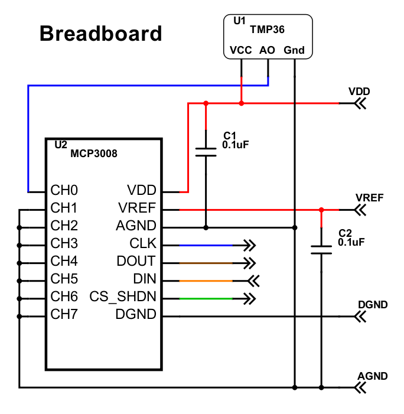

# Temperature Sensor
## Overview
This project shows how you can:
* connect a low-cost temperature sensor to a Raspberry Pi
* write code to print the temperature at regular times

The temperature sensor is an integrated circuit (IC), the TMP36. It produces an **analogue** output voltage.
We need to convert this voltage to a **digital** number, so that the Raspberry Pi can use the data. The conversion is done using a second IC, the MCP3008. This is an Analogue to Digital Converter (ADC for short).

The MCP3008 can connect to 8 separate analogue signals, so we could use the same IC to measure other interesting things - such as humidity and light.

You will need:
* An internet connection
* A Raspberry Pi with EduBlocks Connect installed. Follow the guide on the [Raspberry Pi page](https://edublocks.org/pi.html) to learn more.
* The TMP36 integrated circuit
* The MCP3008 integrated circuit.
* Some capacitors; 0.1uF is a good value.
* A breadboard, such as [this.](https://www.kitronik.co.uk/2401-small-prototype-board-pbu301.html)

## Mounting the integrated circuits on a breadboard
Duration: 10:00

Use the breadboard to wire up the 2 ICs and the 2 capacitors; the circuit diagram is shown below (the arrows represent connections you will make in the next step):

positive
: **Make sure you wire the TMP36 correctly** - see the photo below, which shows the flat face of the plastic package upwards.

positive
: Also make sure the 2 capacitors are placed **close** to the MCP3008.
If you place the TMP36 a long distance (say, more than 2 cm) from the breadboard then connect a 0.1uF capacitor between its VCC and Gnd pins.

The photo shows an example of wiring it up:

and from another angle:

## Connecting the breadboard to the Pi
Duration: 5:00

The circuit diagram below shows the breadboard and Rpi connections:

This photo shows an example of wiring it up:

## Get started with the code
Duration: 2:00
* Launch EduBlocks Connect (from the Pi's Programming menu)
* Launch a web browser and go to http://app.edublocks.org/
* When this has loaded, select Raspberry Pi **mode**.
* You should now see the coding blocks on the left of the screen

## Setting up the libraries
Duration: 2:00

* Click on `Basic`
* Click and drag an `import time` block to the coding area and drop it there.
* In the `gpiozero` menu click on `General`
* Click on `from gpiozero import *` and drag and drop this onto the code area

Your code should look like this:

## Setting up the ADC
Duration: 5:00

* In the `gpiozero` menu click on `Internal & SPI Devices` and then click on `Analogue to Digital`
* Click on `var = MCP3001` and drag and drop this onto the code area
* In this block, click on the left-hand drop-down list and select `Rename variable`; change it to `Vtmp36`. (This creates an "object" called Vtmp36).
* Still in this block, click on the right-hand drop-down list and select `MCP3008`. (This is the 8-channel version of the MCP300x ADCs).
* And on the right of this block, type `0` between the brackets. (This means we are going to use channel 0 of the ADC).
* In the `basic` menu click on the `while True` block and drag and drop this onto the code area.
* Now you need a couple of `#your own code` blocks, also from the `Basic` menu. These blocks allow you to add some slightly more complex code; you will write **python** code in these!
* In the first block type `Reading=Vtmp36.value`. This will take a reading from the Vtmp36 object and put it in the `Reading` variable.
* In the second block type `Temperature=(Reading*3.3-0.5)*100`. This does some simple arithmetic on the `Reading` variable and puts the result in the `Temperature` variable.
* In the `Basic` menu click on the `print(Variable)` block and drag and drop this onto the code area. Change the variable name to `Temperature`.
* Finally add a `time.sleep` block from the `Basic` menu and type a number of seconds that you want your code to wait between making readings.

Your code should look like this:

## Test your code
Duration: 1:00

* Click `Run`
*
You should see the temperature displayed on the screen:

## Optional: rounding the displayed number

The output from our code gives a misleading view of accuracy. Because the ADC converts readings to 1024 different numbers, then the real "resolution" is about 0.27 degrees C.

So we should display the temperature to, say, the nearest 0.5 degrees.

This can be done in a few easy steps:
* First we multiply the Temperature variable by 2
* Then we round that number to an integer, using the python round() function
* Then we divide that by 2

We can do these mathematical operations in 3 simple steps. Your code should like this:

If you want you can combine the steps together - but it makes the code harder to understand!

## Optional: correcting for sensor error

The TMP36 isn't totally accurate - it could have an error of up to +/-2 degrees C. Luckily it's easy to do some arithmetic on the displayed number, if you know the error.
I reckon my TMP 36 is reading about 1 degree low so I have inserted a code block as shown below:

## The maths behind the code

The TMP36 generates an analogue ouput voltage, Va:
Va = 0.5 + 0.01*T

The MCP3008 converts this voltage to an integer number D using this formula:
D = 1024*Va/3.3

The gpiozero library converts D to a number R in the range 0 to 1:
R = 1*D/1024.

So R = Va/3.3
 = (0.5+0.01*T)/3.3
  
So T =  (R*3.3-0.5)*100

---